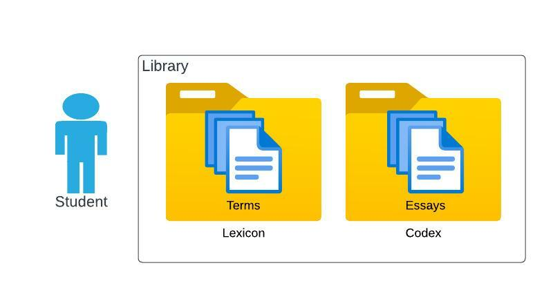

# Alexandria

Alexandria is a decentralized shareable digital library of essays (ideas).

## Model

The model of Alexandria is centered on the individual user called a `student`.

Each `student` has a `library` containing a `lexicon` used to describe the
`student`'s unique vocabulary of `terms` and a `codex` containing the
`student`'s `essay`s or ideas.

## Document management

The Lexicon and Codex both contain bodies of texts called terms and essays
which are only different in purpose.  Documents in these collections have
document management features such as comments, versioning, document 
state (draft, published), security (who can see, who can comment, etc).

### Terms
A term is meant to be a short defition of a word of explanation of a phrase
used commonly by the student, but outside how it may be commonly used in
everyday speaking.  Some times this might just be nuance on an existing
defition or the stating of an obscure concept that is referenced often in the
student's essays.  These should be limited to a paragraph of text,  something
that could we wieldable as a popup or on a sidebar when viewing an essay.

### Essays
An essay is a longer writing on a topic or idea.  They are meant to be living
documents, evolving over time through comments and discussion.  Essay's are
the main sharable content in this overall network of individual libraries and
are analogous to a 'post' on social media sites.

## Networking
Alexandria is meant to be run as a peer-to-peer system, students each running
their own node with information being shared and updated when peers are
able to connect.  To support this, students can also choose to store their
information online to be made accessible through an online super-node.